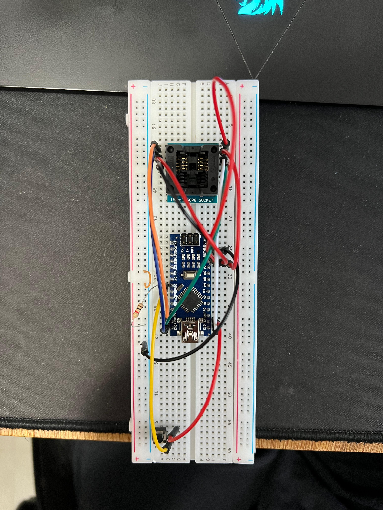

# Arduino SPI EEPROM
Simple project to read and write a ST 95080 8Kbit/1KB EEPROM.

## PINS
### ST 95080
1 - D10 
2 - D12 
3 - VSS (5v) 
4 - GND 
5 - D11 
6 - D13 
7 - VSS (5v) 
8 - VSS (5v) 

### Write button
Simple push button with ground resistor that gives high signal in D5.

## Protoboard Circuit

## ST 95080 Datasheet

